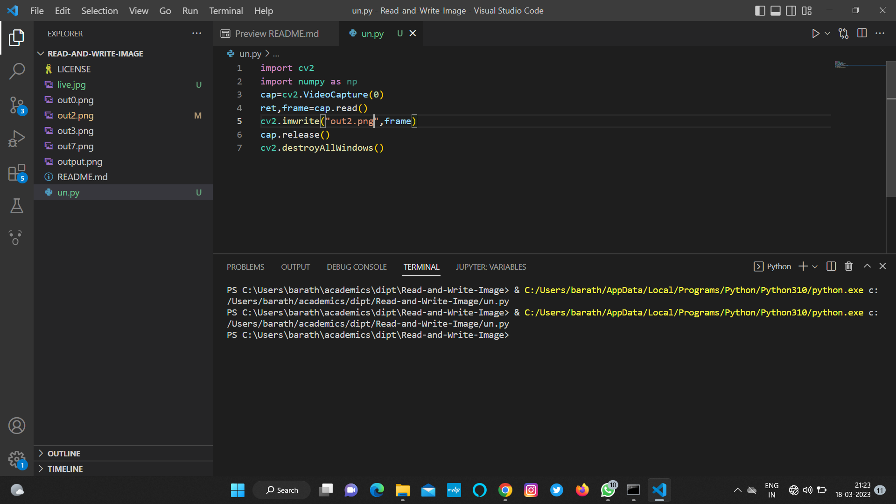
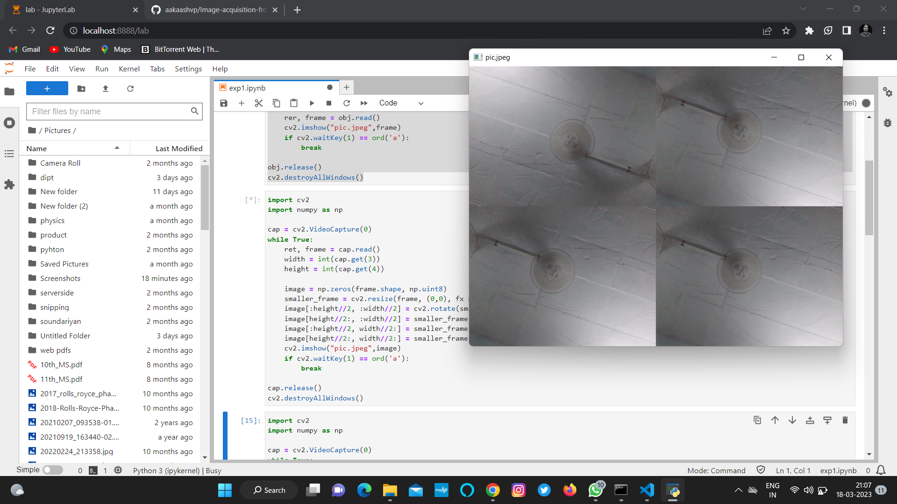

# Image-Acquisition-from-Web-Camera
## Aim
 
Aim:
 
To write a python program using OpenCV to capture the image from the web camera and do the following image manipulations.
i) Write the frame as JPG 
ii) Display the video 
iii) Display the video by resizing the window
iv) Rotate and display the video

## Software Used
Anaconda - Python 3.7
## Algorithm
### Step 1:
Use VideoCapture(0) to access web camera

### Step 2:
Use imread to read the video or image

### Step 3:
Use imwrite to save the image


### Step 4:
Use imshow to show the video


### Step 5:
End the program and close the output video windows by pressing 'q'.

## Program: Python
### Developed By: Barath S
### Register No: 212222230018

## i) Write the frame as JPG file
```python
import cv2
import numpy as np
cap=cv2.VideoCapture(0)
ret,frame=cap.read()
cv2.imwrite("live.jpg",frame) 
cap.release() 
cv2.destroyAllWindows()
```


## ii) Display the video
```python
import cv2
obj = cv2.VideoCapture(0)
while True:
    rer, frame = obj.read()
    cv2.imshow("pic.jpeg",frame)
    if cv2.waitKey(1) == ord('a'):
        break
    
obj.release()
cv2.destroyAllWindows()
```


## iii) Display the video by resizing the window
```python
import cv2
import numpy as np

cap = cv2.VideoCapture(0)
while True:
    ret, frame = cap.read()
    width = int(cap.get(3))
    height = int(cap.get(4))
    
    image = np.zeros(frame.shape, np.uint8)
    smaller_frame = cv2.resize(frame, (0,0), fx = 0.5, fy = 0.5)
    image[:height//2, :width//2] = smaller_frame
    image[height//2:, :width//2] = smaller_frame
    image[:height//2, width//2:] = smaller_frame
    image[height//2:, width//2:] = smaller_frame
    cv2.imshow("pic.jpeg",image)
    if cv2.waitKey(1) == ord('a'):
        break
    
cap.release()
cv2.destroyAllWindows()
```


## iv) Rotate and display the video
```python
import cv2
import numpy as np

cap = cv2.VideoCapture(0)
while True:
    ret, frame = cap.read()
    width = int(cap.get(3))
    height = int(cap.get(4))
    
    image = np.zeros(frame.shape, np.uint8)
    smaller_frame = cv2.resize(frame, (0,0), fx = 0.5, fy = 0.5)
    image[:height//2, :width//2] = cv2.rotate(smaller_frame,cv2.ROTATE_180)
    image[height//2:, :width//2] = smaller_frame
    image[:height//2, width//2:] = smaller_frame
    image[height//2:, width//2:] = smaller_frame
    cv2.imshow("pic.jpeg",image)
    if cv2.waitKey(1) == ord('a'):
        break
    
cap.release()
cv2.destroyAllWindows()
```


## Output

### i) Write the frame as JPG image



### ii) Display the video


### iii) Display the video by resizing the window


### iv) Rotate and display the video



## Result:
Thus the image is accessed from webcamera and displayed using openCV.
